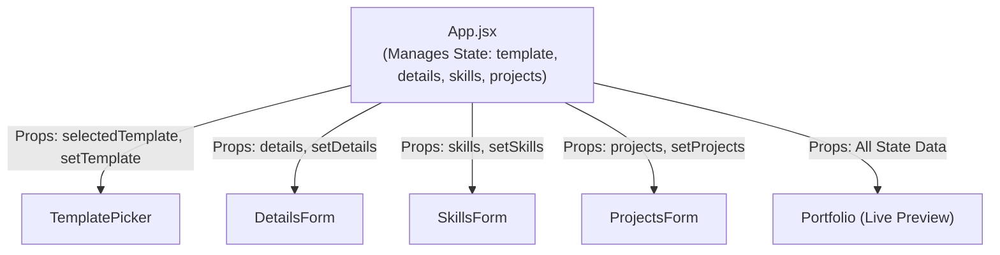

## System Architecture

```mermaid
graph TD
    App["App.jsx<br/>(Manages State: template, details, skills, projects)"]
    
    App -->|Props: selectedTemplate, setTemplate| TP["TemplatePicker"]
    App -->|Props: details, setDetails| DF["DetailsForm"]
    App -->|Props: skills, setSkills| SF["SkillsForm"]
    App -->|Props: projects, setProjects| PF["ProjectsForm"]
    App -->|Props: All State Data| Port["Portfolio (Live Preview)"]
```
